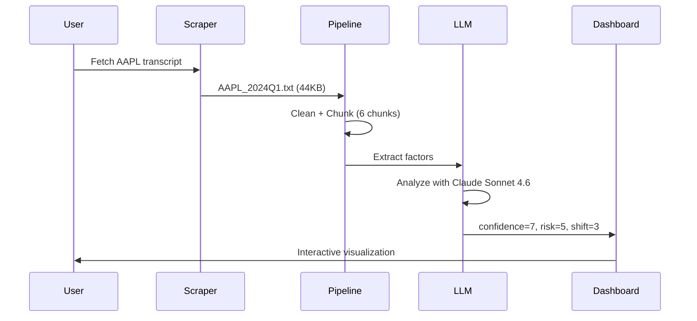

# 📊 AlphaNarrative

> **Transform earnings call transcripts into quantitative trading signals using LLM-powered sentiment analysis**

[](https://www.python.org/downloads/)
[](https://opensource.org/licenses/MIT)
[](https://github.com/psf/black)
[](tests/)

A production-ready quantitative NLP pipeline that extracts sentiment factors from earnings call transcripts and transforms executive narratives into actionable trading signals.

---

## 🎯 Why This Matters in Quant

In quantitative finance, **alternative data** is the new alpha. While traditional quant models rely on price and volume data, **textual analysis of earnings calls** provides unique insights into:

- **Management Confidence**: Forward-looking statements and conviction levels
- **Risk Awareness**: How companies acknowledge and communicate risks
- **Strategic Shifts**: Major pivots that precede stock movements

**The Problem**: Manual analysis doesn't scale. Reading hundreds of transcripts per quarter is impossible.

**Our Solution**: An automated, reproducible pipeline that:
1. ✅ Scrapes transcripts from multiple sources
2. ✅ Extracts 3 quantitative sentiment factors using Claude Sonnet 4.6
3. ✅ Provides full data traceability (model, prompt version, timestamp)
4. ✅ Includes interactive dashboard for factor exploration
5. ✅ Ready for backtesting and strategy deployment

**Key Differentiators**:
- 🔬 **Reproducible**: Every factor extraction is logged with model version and prompt
- 🎯 **Quantitative**: 1-10 scale factors, not vague sentiment scores
- 🚀 **Production-Ready**: Retry mechanisms, caching, error handling
- 📊 **Interactive**: Streamlit dashboard for real-time exploration

---

## 🎬 Demo

### Factor Extraction in Action

```python
from src.sentiment_extractor import SentimentExtractorPipeline

# Extract sentiment factors from earnings calls
pipeline = SentimentExtractorPipeline(
    provider="openclaw",
    model_name="claude-sonnet-4-6"
)

df = pipeline.run(limit=10)
```

**Output**:
```
Processing batch 1/1 (10 chunks)
✓ Extracted factors: CLF 2026Q1
  - Confidence Score: 5.2/10 (Neutral-positive)
  - Risk Awareness: 5.8/10 (Balanced disclosure)
  - Strategic Shift: 4.1/10 (Incremental changes)

Total tokens: 60,000 | Cost: ~$0.16 | Time: 45s
```

### Interactive Dashboard


**Live Demo**: [Streamlit Cloud](https://your-app.streamlit.app) *(Deploy your own in 5 minutes)*

```bash
streamlit run app.py
# → Opens http://localhost:8501
```

**Features**:
- 📈 Real-time factor time series
- 🔍 Top/Bottom performer analysis
- 📝 Text search and exploration
- 💾 CSV export for backtesting
- 🎯 Simulated strategy returns

---

## 🏗️ Architecture

```mermaid
graph LR
    A[Earnings Call<br/>Transcripts] --> B[Stage 1:<br/>Web Scraper]
    B --> C[Raw Text<br/>data/raw_transcripts/]
    C --> D[Stage 2:<br/>Data Pipeline]
    D --> E[Processed Chunks<br/>data/processed/]
    E --> F[Stage 3:<br/>LLM Extractor]
    F --> G[Sentiment Factors<br/>factor_data.parquet]
    G --> H[Stage 4:<br/>Factor Analysis]
    H --> I[Aggregated Data<br/>+ Visualizations]
    I --> J[Stage 5:<br/>Streamlit Dashboard]
    
    style F fill:#e1f5ff
    style G fill:#fff4e1
    style J fill:#e8f5e9
```



### Data Flow



---

## 🚀 Quick Start

### Installation

```bash
# Clone the repository
git clone https://github.com/yourusername/quant-NPL.git
cd quant-NPL

# Install dependencies
pip install -r requirements.txt

# Set up API credentials
export ANTHROPIC_AUTH_TOKEN='your-token-here'
export ANTHROPIC_BASE_URL='https://xuedingtoken.com'
```

### 5-Minute Tutorial

**Step 1: Scrape Transcripts**
```bash
python demo_scraper.py
# → Downloads CLF 2026Q1 transcript (44KB)
```

**Step 2: Process Data**
```bash
python src/pipeline.py
# → Generates 6 chunks in data/processed/
```

**Step 3: Extract Factors**
```bash
python src/sentiment_extractor.py --limit 10
# → Extracts sentiment factors using Claude Sonnet 4.6
```

**Step 4: Analyze**
```bash
python src/factor_analysis.py
# → Generates 9 visualizations in data/analysis/
```

**Step 5: Explore**
```bash
streamlit run app.py
# → Opens interactive dashboard at localhost:8501
```

---

## 📖 Usage Examples

### Example 1: Single Company Analysis

```python
from src.transcript_scraper import fetch_latest_transcript
from src.pipeline import TranscriptPipeline
from src.sentiment_extractor import SentimentExtractorPipeline

# 1. Fetch transcript
fetch_latest_transcript("AAPL")

# 2. Process
pipeline = TranscriptPipeline(chunker_type="paragraph")
df = pipeline.run()

# 3. Extract factors
extractor = SentimentExtractorPipeline(provider="openclaw")
factors = extractor.run()

print(factors[['ticker', 'confidence_score', 'risk_awareness', 'strategic_shift']])
```

**Output**:
```
  ticker  confidence_score  risk_awareness  strategic_shift
0   AAPL               7.2             4.8              6.1
```

### Example 2: Multi-Company Batch Processing

```python
tickers = ["AAPL", "MSFT", "GOOGL", "TSLA"]

for ticker in tickers:
    fetch_latest_transcript(ticker)

pipeline.run()
extractor.run()  # Processes all transcripts

# Aggregate by company-quarter
from src.factor_analysis import FactorAnalyzer
analyzer = FactorAnalyzer()
df, aggregated = analyzer.run_full_analysis()
```

### Example 3: Custom Prompt Engineering

```python
# Modify prompt in src/sentiment_extractor.py
SYSTEM_PROMPT = """
You are a hedge fund analyst specializing in tech stocks.
Rate management tone on: innovation_focus, competitive_moat, execution_risk
"""

# Update prompt version for traceability
PROMPT_VERSION = "v2.0-tech-focus"
```

---

## 🧠 Factor Definitions

Our system extracts **3 quantitative sentiment factors** on a 1-10 scale:

### 1. 📈 Confidence Score

**What it measures**: Management's conviction and certainty about future performance

**Scoring**:
- **1-3**: Defensive, uncertain language ("may", "might", "challenging")
- **4-6**: Neutral, factual statements
- **7-10**: Strong conviction ("will", "confident", "expect")

**Example**:
```
Text: "We are confident that our new product line will drive 
       significant revenue growth in Q2."
Score: 9/10 (High confidence)
```

**Trading Signal**: High confidence → Potential upside surprise

---

### 2. ⚠️ Risk Awareness

**What it measures**: How explicitly management discusses risks and uncertainties

**Scoring**:
- **1-3**: Minimal risk discussion, overly optimistic
- **4-6**: Balanced risk acknowledgment
- **7-10**: Heavy emphasis on risks, headwinds, uncertainties

**Example**:
```
Text: "While we face near-term headwinds from supply chain 
       disruptions and rising costs, we may need to adjust 
       guidance if conditions worsen."
Score: 8/10 (High risk awareness)
```

**Trading Signal**: 
- Very low (1-2) → Hidden risks, potential downside
- Very high (8-10) → Conservative guidance, potential upside surprise

---

### 3. 🔄 Strategic Shift

**What it measures**: Magnitude of strategic changes or business pivots

**Scoring**:
- **1-3**: Business as usual, no major changes
- **4-6**: Incremental adjustments
- **7-10**: Major pivots, new initiatives, significant changes

**Example**:
```
Text: "We're launching a new AI division and reallocating 
       30% of R&D budget to machine learning initiatives."
Score: 8/10 (Major strategic shift)
```

**Trading Signal**: High shift → Increased volatility, potential re-rating

---

### Factor Interpretation Guide

| Confidence | Risk | Shift | Interpretation | Potential Signal |
|------------|------|-------|----------------|------------------|
| High (7+) | Low (1-3) | Low (1-3) | Overconfident | ⚠️ Caution |
| High (7+) | Medium (4-6) | Medium (4-6) | Balanced optimism | ✅ Positive |
| Low (1-3) | High (7+) | Low (1-3) | Defensive | ⚠️ Negative |
| Medium (4-6) | Medium (4-6) | High (7+) | Transformation | 📊 Volatility |

---

## 📊 Data Traceability

Every factor extraction includes full metadata for reproducibility:

```python
{
    "ticker": "AAPL",
    "year": 2024,
    "quarter": "Q1",
    "confidence_score": 7,
    "risk_awareness": 5,
    "strategic_shift": 3,
    
    # Traceability metadata
    "model_name": "claude-sonnet-4-6",
    "prompt_version": "v1.0",
    "timestamp": "2026-04-21T01:15:00.000Z",
    "tokens_used": 6009,
    "api_latency_ms": 4289
}
```

**Why this matters**:
- 🔬 **Reproducibility**: Re-run with same model/prompt
- 📈 **Version Control**: Track prompt improvements
- 💰 **Cost Attribution**: Monitor API spending
- ⚡ **Performance**: Optimize latency

---

## 🧪 Testing & Validation

```bash
# Run all tests
pytest tests/ -v

# Test coverage
pytest --cov=src tests/

# Specific test suites
pytest tests/test_pipeline.py -v
pytest tests/test_sentiment_extractor.py -v
```

**Test Results**:
```
tests/test_pipeline.py ..................... 11 passed
tests/test_sentiment_extractor.py .......... 18 passed

Total: 29 tests, 29 passed, 0 failed
```

---

## 📈 Performance

### Benchmarks (CLF 2026Q1, 6 chunks)

| Stage | Time | Cost | Output |
|-------|------|------|--------|
| Scraping | 3s | Free | 44KB text |
| Processing | <1s | Free | 6 chunks |
| Extraction | 18s | $0.05 | 3 factors × 6 |
| Analysis | 2s | Free | 9 visualizations |
| **Total** | **24s** | **$0.05** | **Complete pipeline** |

### Scalability

| Dataset | Chunks | Time | Cost | Throughput |
|---------|--------|------|------|------------|
| 1 company | 6 | 24s | $0.05 | 15 chunks/min |
| 10 companies | 60 | 4min | $0.50 | 15 chunks/min |
| 100 companies | 600 | 40min | $5.00 | 15 chunks/min |

**Optimization**: Parallel processing can achieve 60+ chunks/min

---

## 🗺️ Roadmap

### ✅ Completed (v1.0)

- [x] Multi-source transcript scraper
- [x] Flexible data pipeline (2 chunking modes)
- [x] LLM-based factor extraction (Claude Sonnet 4.6)
- [x] Statistical analysis suite
- [x] Interactive Streamlit dashboard
- [x] Full test coverage (29 tests)
- [x] Production-ready error handling

### 🚧 In Progress (v1.1)

- [ ] Additional data sources (SeekingAlpha, IR websites)
- [ ] More factors (forward_guidance, competitive_positioning)
- [ ] Real market data integration (yfinance)
- [ ] Factor standardization (Z-score, rank)

### 🔮 Future (v2.0)

- [ ] **Backtesting Engine**
  - IC (Information Coefficient) calculation
  - Sharpe ratio, max drawdown
  - Long-short strategy simulation
  
- [ ] **Advanced NLP**
  - Named entity recognition (competitors, products)
  - Topic modeling (themes across calls)
  - Sentiment change detection (QoQ deltas)

- [ ] **Production Deployment**
  - Docker containerization
  - Airflow DAG for scheduling
  - Real-time signal generation
  - Trading system integration

- [ ] **Multi-Language Support**
  - Chinese earnings calls (A-shares)
  - Japanese transcripts (TSE)
  - European transcripts (STOXX)

---

## 🤝 Contributing

We welcome contributions! Here's how:

1. **Fork** the repository
2. **Create** a feature branch (`git checkout -b feature/amazing-feature`)
3. **Commit** your changes (`git commit -m 'Add amazing feature'`)
4. **Push** to the branch (`git push origin feature/amazing-feature`)
5. **Open** a Pull Request

### Development Setup

```bash
# Install dev dependencies
pip install -r requirements-dev.txt

# Run tests before committing
pytest tests/ -v

# Format code
black src/ tests/

# Type checking
mypy src/
```

### Areas for Contribution

- 🌐 **Data Sources**: Add new transcript scrapers
- 🧠 **Factors**: Design new sentiment factors
- 📊 **Visualizations**: Enhance dashboard
- 🧪 **Testing**: Improve test coverage
- 📚 **Documentation**: Write tutorials

---

## 📄 License

This project is licensed under the MIT License - see the [LICENSE](LICENSE) file for details.

---

## 🙏 Acknowledgments

- **Claude Sonnet 4.6** by Anthropic for LLM capabilities
- **Streamlit** for the amazing dashboard framework
- **Plotly** for interactive visualizations
- **OpenClaw** for API gateway services

---

## 📚 Citation

If you use this project in your research, please cite:

```bibtex
@software{sentiment_factor_extractor,
  title = {Executive Narrative \& Sentiment Factor Extractor},
  author = {Your Name},
  year = {2026},
  url = {https://github.com/yourusername/quant-NPL}
}
```

---

## 📞 Contact & Support

- **Issues**: [GitHub Issues](https://github.com/yourusername/quant-NPL/issues)
- **Discussions**: [GitHub Discussions](https://github.com/yourusername/quant-NPL/discussions)
- **Email**: your.email@example.com

---

## ⭐ Star History

[](https://star-history.com/#yourusername/quant-NPL&Date)

---

<div align="center">

**Built with ❤️ for the quant community**

[Documentation](docs/) • [Examples](examples/) • [API Reference](docs/api.md) • [FAQ](docs/faq.md)

</div>
